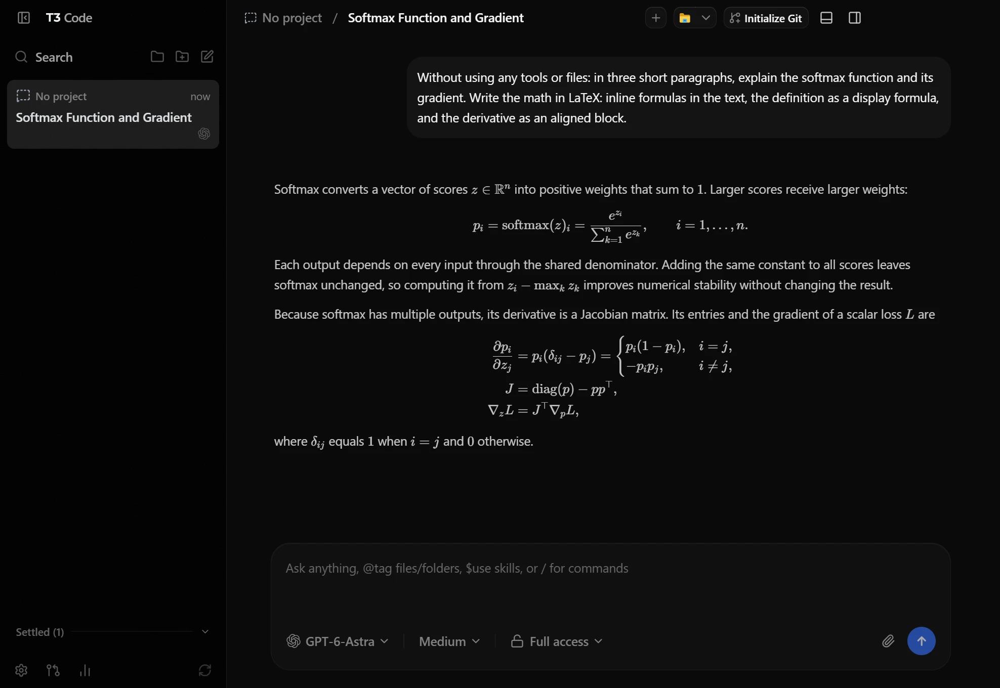
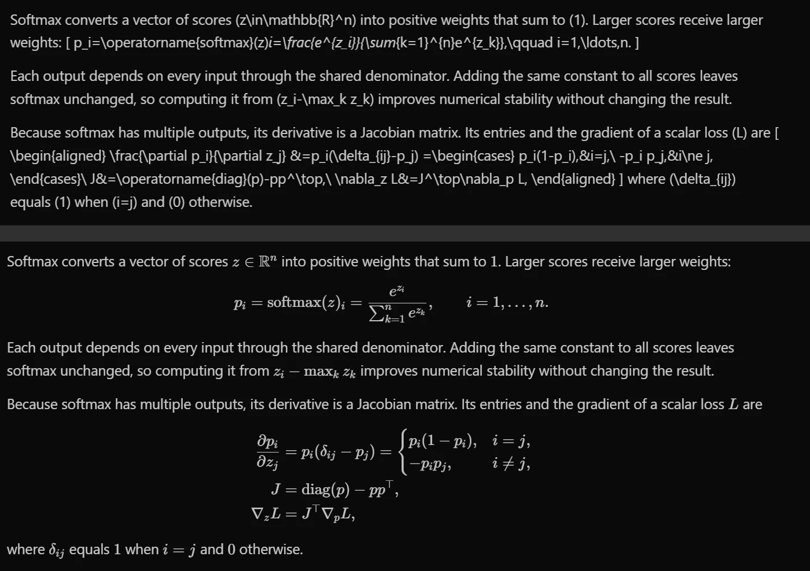
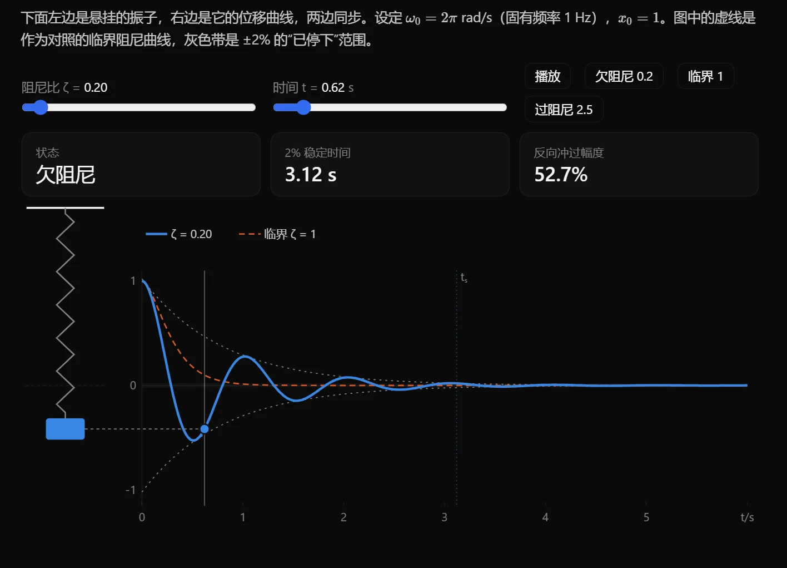
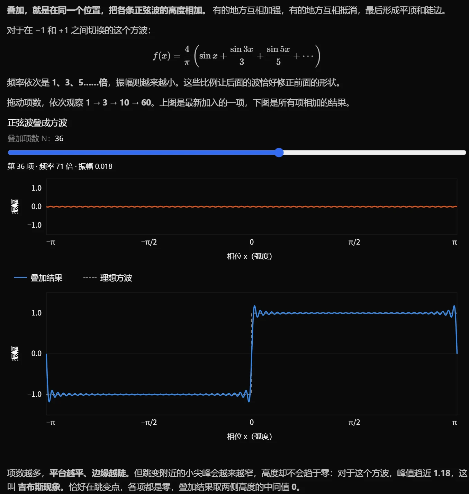

# t3-latex

<p align="center"></p>

LaTeX math for the [T3 Code](https://github.com/pingdotgg/t3code) desktop app on Windows. Open T3 from the **T3 Code (LaTeX)** shortcut and its chat renders `$…$`, `$$…$$`, `\(…\)`, `\[…\]` and bare `\begin{align}` blocks with KaTeX.

It also shows **interactive visualizations** in the chat: a simulation, a plot with sliders or a 3D scene that Claude or Codex puts in its reply runs right there, as in OpenAI's Codex app.

It is not a fork and it doesn't patch T3's install: the official T3 runs, keeps auto-updating, and opened from its own icon it is exactly as shipped. All of this is loaded into T3 at startup and only by this shortcut.

<sub>Unofficial; not affiliated with T3 Tools. Please report problems [here](https://github.com/Zane-0x5a/t3-latex/issues), not on T3 Code's tracker. · [中文说明 →](README.zh-CN.md)</sub>

<p align="center"></p>
<p align="center"><sub>The same reply: T3 Code as shipped (top) and opened through t3-latex (bottom).</sub></p>

## What it renders

- Inline `$…$` and `\(…\)`; display `$$…$$` (on one line or several), `\[…\]`, `align`, `equation` and other environments on their own lines, and ```` ```math ```` fences.
- Display math in list items and quotes stays in them; `|x|` and `\|v\|` in table cells don't split the table.
- No false positives: prices like `$5 and $10`, `$HOME`, `$` in code spans and code blocks, and escaped `\$` stay text. The rules follow pandoc's: an opening `$` can't be followed by a space, a closing `$` can't follow a space or be followed by a digit.
- While a reply streams in, an unclosed `$$` or `\[` shows as text until it closes. Nothing after it gets swallowed, and no red errors flash up.
- Equation numbers restart at (1) in each message. `\label` is dropped (KaTeX doesn't support it). `\ce{H2O}` works (mhchem).
- Display math wider than the chat scrolls sideways.
- Copying a selection copies formulas as `$…$` / `$$…$$` source, through T3's own copy handler.
- T3's **Cite** works on text with formulas and quotes them as TeX. A selection that touches a formula takes the whole formula, and dragging from a formula or double-clicking one works too.
- Screen readers read the TeX source.
- Each formula is typeset once and cached, so a streaming reply doesn't re-run KaTeX on every token.

## Interactive visualizations

<p align="center"></p>

Claude can put a live visual in a reply: a simulation, a plot with sliders, a 3D scene, a geometric construction. It writes it as a ```` ```visualize ```` block of HTML, and t3-latex runs it in place.

- Ask for one ("show me with something I can drag"), or let Claude offer one when turning a knob would make an idea click. The installer puts the `t3-visualize` skill into Claude Code's skills folder; it tells Claude, when it runs in T3, when a visual helps and how to write one.
- Each visual runs in a sandboxed frame: it can't reach T3, your files or the network. It follows T3's light and dark themes, and its height fits its content.
- d3, three.js (with its addons) and KaTeX are bundled, so visuals work offline. Scripts from jsDelivr, unpkg, esm.sh and cdnjs load too.
- Slider and input values are remembered per visual: scroll away and back, or reopen the thread, and they are still set.
- Hovering shows two buttons under a visual: expand it to most of the window (it keeps running) and reset it.
- If a visual's code throws, the error shows in it, with a button that puts a fix request into the composer. A visual can offer follow-up questions the same way. Both go into the composer for you to send, and only right after you click in that visual.
- While the block streams in, a placeholder shows its size; the visual starts once the block is complete.
- Copying a message copies the block's source.

### Codex's visuals

<p align="center"></p>

Codex has a visualize plugin of its own (it comes with the Codex app, and T3 loads Codex's plugins too). It writes the visual to an HTML file and puts a `visualize{"path": …}` line in its reply. T3 as shipped shows that line as text; with t3-latex the visual shows in its place, in the same sandbox and with the same theme, expand and reset as above.

- Nothing to set up: ask Codex in T3 to show you something, or let it offer.
- What Codex's visuals expect from their host is there: `window.openai` (the state a visual saves, follow-up questions, links), Lucide icons, tabs, variant carousels, and the classes of Codex's stylesheet.
- The file is read each time the message shows, so a visual Codex later updates shows its new version.

## Install

You need Windows 10 or 11 and the [T3 Code desktop app](https://github.com/pingdotgg/t3code/releases), Stable or Nightly.

1. Download `t3-latex-<version>.zip` from [Releases](https://github.com/Zane-0x5a/t3-latex/releases/latest). Extract it to a folder it can stay in, such as `%LOCALAPPDATA%\t3-latex`: the shortcut points into it.
2. Double-click `install.cmd`. If SmartScreen warns about a downloaded script, choose *More info → Run anyway*, or unblock the zip in its Properties before extracting.
3. Quit T3 completely, tray icon included, and open **T3 Code (LaTeX)** from the Start menu or the desktop.

The installer adds one shortcut to the Start menu and one to the desktop, and copies the `t3-visualize` skill into `%USERPROFILE%\.claude\skills` (or `CLAUDE_CONFIG_DIR\skills`). Nothing else changes. The shortcut has its own taskbar identity, so you can pin it in place of T3's icon and the T3 window it opens groups under the pin.

- If T3 is already running from its usual icon, the shortcut asks you to quit it first: T3 runs one instance, and that one can't load math any more.
- If T3 is already running from this shortcut, clicking it again brings the window forward.
- Each start looks T3 up in the registry entry of T3's installer. So it doesn't matter where T3 is installed (`Programs\t3-code-desktop` for older installs, `Programs\t3code` for newer ones) or which channel you use (`T3 Code (Alpha).exe` or `T3 Code (Nightly).exe`). To use some other T3 exe, set the environment variable `T3LATEX_T3_EXE` to it.

**Updating t3-latex:** quit T3, extract the new zip over the old folder and run `install.cmd` again.

**Uninstalling:** double-click `uninstall.cmd`, which removes the shortcuts, their icon, the skill and the logs in `%TEMP%\t3-latex`, then delete the folder. T3 itself was never changed, so there is nothing else to undo.

Tested with T3 Code 0.0.45 on Windows 11. The test suite also passes against the code of the 0.0.46 nightly (the "orchestrator v2" rewrite).

## How it works

```
shortcut → conhost --headless → launcher\t3-latex.cmd → find-t3.cmd finds T3's exe
         → launch.cjs runs on that exe as Node (ELECTRON_RUN_AS_NODE)
         → it starts T3 with --inspect-brk, so T3's main process stops at its first line
         → it connects to that local port, has the main process load mod\loader.cjs,
           lets T3 continue and closes the port
```

Inside T3's main process, `mod/loader.cjs`:

1. Wraps the handler T3 registers for its `t3code://` scheme. Through it, it serves `mod/assets/` (KaTeX's stylesheet and fonts, the renderer module, and the frame visualizations run in) under `t3code://app/__t3latex/` (`mod/serve.cjs`), and adds the first two to the window's `index.html`.
2. Edits the one script that holds react-markdown (`mod/patch.cjs`):
   - it appends remark-math to the `remarkPlugins`;
   - it appends KaTeX to the `rehypePlugins`, after T3's sanitizer, which would strip KaTeX's markup;
   - it passes the markdown through a delimiter normalizer (`src/normalize.js`) first.

   The edits are found by react-markdown's own option names, which minifiers keep, not by anything specific to a T3 version.
3. Keeps math when T3 restarts itself:
   - settings that relaunch T3 relaunch it through `t3-latex.cmd`;
   - for *Restart to update*, it drops the installer's `--force-run`. `mod/after-update.js` (Windows Script Host) then waits for the installer to finish and starts the new T3 through `t3-latex.cmd`. That also finds T3 again if the update renamed its exe.
   - It keeps `--inspect-brk` away from the processes T3 starts.

If any step fails, T3 runs as shipped and shows plain text:

- **T3 can't be found:** a message box says so.
- **The loader can't load:** T3 opens normally, and a message box gives the reason and the log's path.
- **A T3 update reshapes react-markdown so that the edits no longer match:** T3 gets its original script and you get a notification.

The logs are `%TEMP%\t3-latex\launcher.log` and `%TEMP%\t3-latex\loader.log`.

### Visualizations

- `src/visualize.js` turns a ```` ```visualize ```` block into a `<t3latex-viz>` element, and a block still streaming in into a placeholder.
- `src/viz-element.js` defines that element. It holds a sandboxed iframe (`allow-scripts` only, so an opaque origin) on `t3code://app/__t3latex/frame/frame.html`, which `mod/serve.cjs` serves with its own Content-Security-Policy: scripts from the bundled libraries and the four CDNs, nothing fetched from anywhere.
- The block's HTML, T3's theme and the remembered input values reach the frame in its `window.name`. `frame/runtime.js` writes the HTML into the page while the page is still parsing, so its scripts run in order, as on any page.
- The frame reports its height, its input values and the user's requests (a question for the composer, a link for the browser) over `postMessage`. The page treats all of it as untrusted: the composer and the browser need a click in that frame just before.
- Heights and input values are kept in T3's `localStorage`, keyed by a hash of the block, for the last 300 visuals.
- A Codex line (Codex wraps it in private-use characters: U+E200 `visualize` U+E202 `{…}` U+E201) becomes the same element with the file's path in it. The element reads the file through the loader at `t3code://app/__t3latex/file?path=…` (`mod/serve.cjs`), which serves only `.html` files and only to T3's own page: no CORS headers, and requests from an opaque origin such as the frame are refused. `frame/runtime.js` gives Codex's HTML its `window.openai`, Lucide, tabs and carousels; the state it saves is kept like the input values.

### Formulas and Cite

T3's Cite builds the quote from a message's text nodes and skips anything `aria-hidden`. It also offers no Cite when the selection starts or ends inside `aria-hidden` content, and KaTeX's glyphs are exactly that. So:

- `src/katex.js` puts invisible source text before and after each formula's glyphs (`$x^2` and `$`), and T3's quote reads `$x^2$`.
- `src/selection.js` moves selection ends that land in a formula onto that source text. It runs after the mouse is released and before T3 reads the selection.
- Chromium can't start a selection by dragging from KaTeX glyphs, on any page. `src/selection.js` handles that drag itself.

## Limitations

- **Only this shortcut loads math.** T3 started from its own icon, at login or by a `t3code://` link is plain T3.
- **The debug port.** For about 0.2 s while T3 starts, its main process has a debug port open on a random port of `127.0.0.1`; the launcher closes it once the loader is in. During that time another program on the same machine could, in principle, connect to it.
- **Two Electron fuses.** The approach needs T3's exe to accept `--inspect-brk` and `ELECTRON_RUN_AS_NODE`. Both fuses are on today, and T3's own Windows server relies on the second one. If T3 turns either off, this way of loading stops working.
- **The skill is for Claude Code;** Codex uses its own plugin (above). Other models in T3 draw a visual only when asked for a ```` ```visualize ```` block of HTML, without knowing the conventions.
- **Codex's visuals, as far as T3 goes.** Codex's day-schedule widget (`<viz-calendar>`) and its design-control panel for mockups (`Tweak`) aren't there; a visual using them shows the rest. The state a visual saves stays with it: the Codex app passes it back to the model, T3 doesn't. And the file has to be on this PC: a Codex running in WSL or on a remote machine writes it where t3-latex can't read it.
- **CDN scripts need the network,** and some CDNs are slow or blocked on some networks. The bundled libraries don't.
- **Windows only.**

## Development

```sh
git clone https://github.com/Zane-0x5a/t3-latex && cd t3-latex
npm install
npm run build       # mod/assets
npm test            # see below
npm run package     # dist/t3-latex-<version>.zip
powershell -ExecutionPolicy Bypass -File install.ps1   # shortcuts pointing at this checkout
```

`npm test` covers:

- the delimiter normalizer and the whole rendering pipeline, visualization blocks included;
- the visualization frame's runtime (in jsdom), Codex's API included, and what the loader serves (the frame's policy, CORS, no path escapes, Codex's files only to T3's page);
- the react-markdown edits and Cite on rendered formulas, both run against the code of the T3 installed on the machine (set `T3LATEX_T3_DIR` to a folder holding another build's `resources\server.asar` to check that build);
- the launcher's environment;
- the batch files. These tests briefly write and then delete the registry key `HKCU\Software\t3latex-test`.

An isolated T3 for trying changes. It has its own `APPDATA`, `T3CODE_HOME`, `TEMP` and taskbar identity and auto-update off, so it never touches the T3 you use, and it keeps rendering while covered by other windows:

```sh
node dev/t3.cjs start                 # start it; its main-process inspector stays open for the commands below
node dev/t3.cjs shot out.png          # screenshot of its window
node dev/t3.cjs js "<expr>|@file"     # evaluate in its window
node dev/t3.cjs main "<expr>|@file"   # evaluate in its main process
node dev/t3.cjs frame "<expr>|@file"  # evaluate in every visualization frame (out-of-process, sandboxed)
node dev/t3.cjs click X Y             # a real mouse click at window CSS pixels, reaching into those frames
node dev/t3.cjs stop
powershell -File dev/iso-launch.ps1 [-Plain] [-Dialog]   # start it with the shortcut's command line
node dev/t3.cjs main @dev/simulate-update.js            # simulate "Restart to update"
node dev/t3.cjs js @dev/copy-selection.js               # what copying the last message gives (leaves the clipboard alone)
```

```
src/normalize.js        delimiter normalizer ($$…$$, \[…\], \(…\), bare environments, prices, unclosed while streaming)
src/katex.js            cached rehype-katex with data-markdown-copy (T3's copy) and hidden source text (T3's Cite)
src/selection.js        selections snap to whole formulas; drags that start on a formula
src/plugins.js          the remark / rehype plugins handed to T3, and the markdown pass before them
src/visualize.js        ```visualize blocks and Codex's visualize{"path"} lines → <t3latex-viz>; still streaming → a placeholder
src/viz-element.js      <t3latex-viz>: the sandboxed frame, theme, height, remembered state, expand and reset; reads Codex's files
src/boot.js             renderer entry, exposed as globalThis.__t3latex
src/t3-latex.css        KaTeX layout fixes for the chat (sideways scrolling, numbering per message)
mod/loader.cjs          the loader in T3's main process
mod/patch.cjs           the react-markdown edits
mod/serve.cjs           serves mod/assets (CORS for the frame, the frame's policy) and Codex's visual files
mod/after-update.js     brings T3 back through the launcher after an update
mod/assets/             built by build.mjs (with THIRD-PARTY-NOTICES.txt)
frame/                  the frame page: frame.html, runtime.js, frame.css, library entries
skill/t3-visualize/     the Claude Code skill install.ps1 copies
launcher/launch.cjs     the launcher
launcher/t3-latex.cmd   what the shortcut runs
launcher/find-t3.cmd    finds T3's exe in the registry
install.ps1 / uninstall.ps1, install.cmd / uninstall.cmd
dev/                    the isolated T3
test/                   node --test
```

## License

[MIT](LICENSE). The release zip bundles KaTeX, remark-math, d3, three.js, Lucide and their dependencies. Their licences are in `mod/assets/THIRD-PARTY-NOTICES.txt`.
